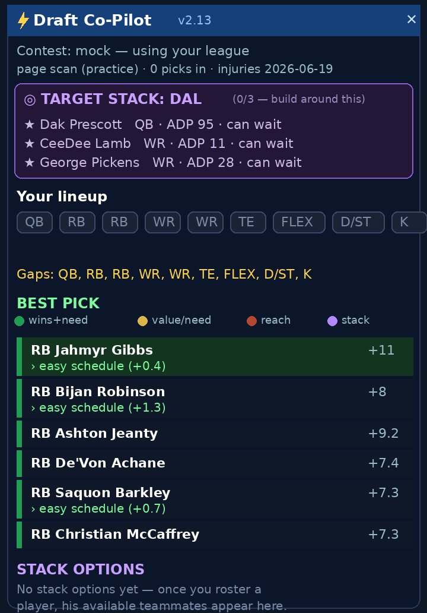

# ⚡ Draft Co-Pilot

**A live, value-based draft assistant that runs inside the ESPN fantasy football draft room.**

Draft Co-Pilot is a Chrome extension (Manifest V3, vanilla JS, zero dependencies) that gives real-time pick recommendations tuned to *your* league's exact scoring. It reads the live draft board from ESPN's own API, values every player by **VBD (value over replacement) computed under your league's rules**, then layers in winning-draft strategy — a streaming-aware QB baseline, RB/WR depth balancing, strength-of-schedule tilt, and a full QB-stacking engine that helps you build correlated, high-ceiling rosters.

It was built and tuned iteratively, with each change **validated against ESPN's own post-draft report-card grades**.

> ⚠️ **Heads up — this is tuned to my league.** The strategy weights and stack list were calibrated to *my* specific ESPN league and its custom scoring system (half-PPR with several quirks). It auto-detects scoring, roster slots, and draft position from whatever league you point it at, but the tuning reflects my format. **To use it yourself, set your own league ID** in `content.js` (the `REAL` constant near the top), and expect to adjust the strategy weights to match your league's scoring. Results will vary by format.

---

## What it does

- **Scoring-aware value engine.** Pulls your league's scoring + roster settings and projects every player under *those* rules, then ranks by value-over-replacement (VBD) — not generic rankings. Surfaces the **BEST PICK**, refreshing live as players come off the board.
- **Color-coded picks.** Each suggestion gets a 🟢 / 🟡 / 🔴 bar (strong value + fills a need / one or the other / poor fit or reach), plus 🔥 steal and 📉 value flags.
- **Streaming-aware QB baseline.** Values QB1 against the best QB likely to survive to your *next* pick, so it waits on QB instead of over-drafting one early.
- **Per-seat blueprint.** Tailors the early-round positional plan to your draft slot.
- **RB/WR depth balancing.** Favors whichever position is thinner in the flex/bench rounds to prevent positional gluts.
- **Strength-of-schedule tilt.** A capped, position-aware nudge toward players facing weak defenses, built from the real season schedule + each defense's projected strength (championship weeks weighted heavier).
- **Stacking engine.** Rewards QB + same-team pass-catchers (correlated scoring), an "onslaught" bonus for loading up on one elite offense, an always-on **STACK OPTIONS** panel, a live **🎯 TARGET STACK** that picks the cheapest stack to complete for your seat and tells you the exact pick to grab each piece — and a 🎉 triple-stack celebration (with a voice call-out).
- **Self-grade + audit trail.** Grades your roster as you build, and the project log compares the tool's grade to ESPN's after each mock.

## Tech

- **Manifest V3 Chrome extension**, single content script, no build step, no third-party libraries.
- Reads **live data from ESPN's fantasy API** (league settings, player projections, pro schedule, defense strength) via the user's authenticated browser session — nothing leaves the browser.
- Stays current automatically: stacks and player/team data are derived from ESPN's live season data at runtime; an injury-adjustment layer is refreshed daily by a scheduled task.

## Install (load unpacked)

1. Clone or download this folder.
2. Open `chrome://extensions` and turn on **Developer mode** (top-right).
3. Click **Load unpacked** and select the `DraftCoPilot_Extension` folder.
4. Open an ESPN draft room — the panel appears automatically, top-right (drag the header to reposition). The version shows in the header.

## Configuration

The target league is set by a single constant near the top of `content.js` (`REAL = <leagueId>`); point it at your own league. Scoring, roster slots, and draft position are then auto-detected from that league.

## Project layout

- `content.js` — the whole engine + UI (value model, strategy layers, stacking, panel).
- `manifest.json` — MV3 manifest.
- `adjustments.json` — injury/availability layer (refreshed daily).
- `sos.json` — strength-of-schedule tilt data (built from the live schedule + defense strength).

---

## Build story (changelog)

A condensed history — each step was driven by a real mock draft and verified against ESPN's grade:

- **v2.13** — Stacks generated from live season rosters (no stale hand-curated lists).
- **v2.11–2.12** — Stack-first *targeting*: picks the cheapest stack to complete for your seat and only pushes a piece when it won't survive to your next pick ("let the stack come to you").
- **v2.6–2.10** — Stacking engine: QB↔pass-catcher correlation, elite-offense onslaught, always-on stack options, top-stacks reference, triple-stack alert.
- **v2.5** — Draggable panel + live strength-of-schedule data.
- **v2.4** — Scoring-aware green/yellow/red color-coding.
- **v2.3** — RB/WR depth balancing + SOS tilt engine.
- **v2.1** — Streaming-aware QB baseline, per-seat blueprint, smarter self-grade.
- **v2.0** — Value/VBD core, don't-reach + steal detection, self-grade.

> Built by Edmund Gray as a fantasy-football drafting tool and an exercise in iterative, data-validated engineering.
