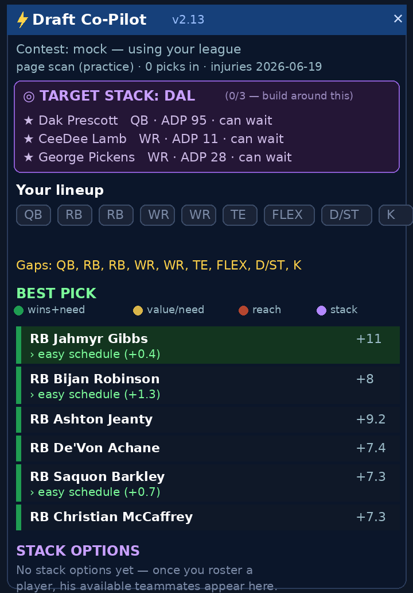

# ⚡ Draft Co-Pilot

**A live, value-based draft assistant that runs inside the ESPN fantasy football draft room.**

> **Source available on request.** This is a case study, not a distribution. The engine and its tuning data are proprietary and kept in a private repository while the product is being prepared for commercial release. Hiring teams and technical reviewers: email **EdmundGrayworks@gmail.com** and I will walk you through the code directly or grant read access.

Draft Co-Pilot is a Chrome extension (Manifest V3, vanilla JS, zero dependencies) that gives real-time pick recommendations tuned to *your* league's exact scoring. It reads the live draft board from ESPN's own API, values every player by **VBD (value over replacement) computed under your league's rules**, then layers in drafting strategy: a streaming-aware QB baseline, RB/WR depth balancing, strength-of-schedule tilt, and a full QB-stacking engine for correlated, high-ceiling rosters.

It was built and tuned iteratively across **30+ shipped versions**, with each change **validated against ESPN's own post-draft report-card grades**. An outside scorekeeper graded the work rather than the tool grading itself.

---

## What it does

- **Scoring-aware value engine.** Pulls your league's scoring and roster settings, projects every player under *those* rules, then ranks by value over replacement rather than generic rankings. Surfaces the **BEST PICK**, refreshing live as players come off the board.
- **Color-coded picks.** Each suggestion gets a 🟢 / 🟡 / 🔴 bar (strong value and fills a need / one or the other / poor fit or reach), plus 🔥 steal and 📉 value flags.
- **Streaming-aware QB baseline.** Values QB1 against the best QB likely to survive to your *next* pick, so it waits on QB instead of over-drafting one early.
- **Per-seat blueprint.** Tailors the early-round positional plan to your draft slot.
- **RB/WR depth balancing.** Favors whichever position is thinner in the flex and bench rounds to prevent positional gluts.
- **Strength-of-schedule tilt.** A capped, position-aware nudge toward players facing weak defenses, built from the real season schedule and each defense's projected strength, with championship weeks weighted heavier.
- **Cliff detection.** Reacts to live positional runs and drop-offs at RB, WR, and TE.
- **Stacking engine.** Rewards QB plus same-team pass catchers, an "onslaught" bonus for loading up on one elite offense, an always-on **STACK OPTIONS** panel, and a live **🎯 TARGET STACK** that picks the cheapest stack to complete for your seat and names the exact pick to grab each piece.
- **Self-grade and audit trail.** Grades your roster as you build, and the project log compares the tool's grade to ESPN's after each mock.

## Engineering notes

- **Manifest V3 Chrome extension**, single content script, no build step, no third-party libraries.
- Reads **live data from ESPN's fantasy API** (league settings, player projections, pro schedule, defense strength) through the user's own authenticated browser session. **Nothing leaves the browser.**
- Every strategy layer is **clamped** so it nudges rather than overrides the value model. That constraint is what kept 30+ tuning passes from fighting each other.
- Stays current automatically: stacks and player/team data derive from ESPN's live season data at runtime, and an injury-adjustment layer refreshes daily on a scheduled task.

## Build story

A condensed history. Each step was driven by a real mock draft and verified against ESPN's grade:

- **v2.17** — Position-aware "edge" tags explaining why a player wins under your scoring.
- **v2.16** — Consensus draft round from live ADP, with a green ↓ when a player slips past it.
- **v2.15** — Stacking simplified to a pure value/need/cliff engine plus a "stack unlocked" alert.
- **v2.14** — Positional cliff awareness for RB/WR/TE.
- **v2.13** — Stacks generated from live season rosters, retiring stale hand-curated lists.
- **v2.11–2.12** — Stack-first targeting: pick the cheapest stack to complete, and only push a piece when it will not survive to your next pick.
- **v2.6–2.10** — Stacking engine: QB and pass-catcher correlation, elite-offense onslaught, stack options, triple-stack alert.
- **v2.5** — Draggable panel and live strength-of-schedule data.
- **v2.4** — Scoring-aware green/yellow/red color coding.
- **v2.3** — RB/WR depth balancing and SOS tilt engine.
- **v2.1** — Streaming-aware QB baseline, per-seat blueprint, smarter self-grade.
- **v2.0** — Value/VBD core, don't-reach and steal detection, self-grade.

---

## Legal

**Copyright © 2026 Edmund Gray. All rights reserved.**

This repository documents the project. It does not grant a license to any part of it. The source code, tuning data, strategy weights, and accompanying assets are proprietary. No permission is given to copy, modify, distribute, sublicense, or sell any portion of this work, whether or not the code appears in this repository's history.

Built by Edmund Gray as a drafting tool and an exercise in iterative, data-validated engineering.
📫 **EdmundGrayworks@gmail.com** · [GitHub](https://github.com/howrealizdat) · [LinkedIn](https://www.linkedin.com/in/edmundgraylinked)
